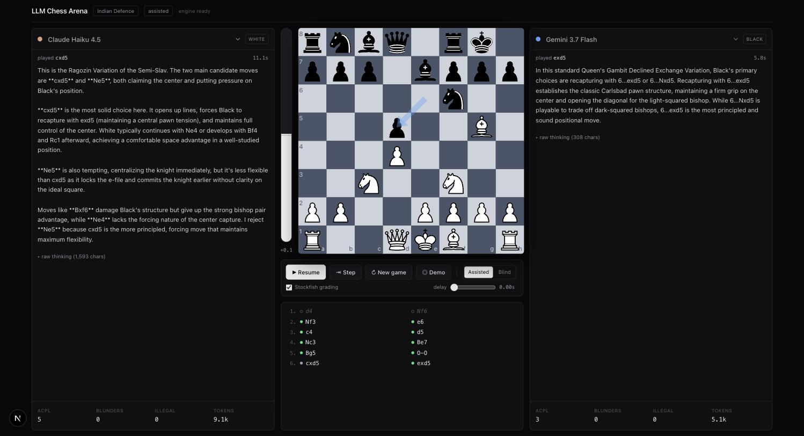
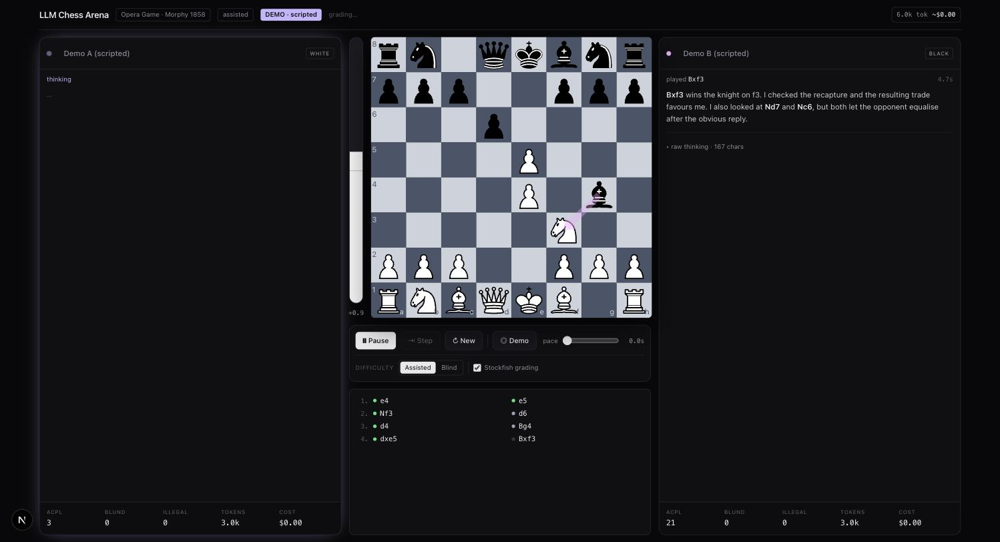

<div align="center">

# ♟️ LLM Chess Arena

### Two AI models play chess. You watch them think. Stockfish grades every move.

[](https://nextjs.org)
[](https://typescriptlang.org)
[](https://ai-sdk.dev)
[](https://stockfishchess.org)



</div>

---

## Why this exists

Most model comparisons are vibes. This one has a scoreboard.

A chess game normally gives you **one bit of information**: who won. That's almost meaningless for comparing two models — a single game is a coin flip, and you'd need dozens before you could say anything.

So every move gets graded by **Stockfish**, a chess engine far stronger than any language model. Suddenly one match yields **~40 independently scored decisions per model**, and you get a real measurement instead of an anecdote:

- **ACPL** — average centipawn loss, the accuracy number chess players actually use
- **Blunder rate** — how often it threw away material or the game
- **Illegal move rate** — how often it hallucinated a move that isn't legal
- **Tokens spent vs. quality gained** — is all that thinking buying anything?

It also catches what winning hides: a model can win while blundering repeatedly, simply because its opponent blundered worse.

---

## Try it with no API key

There's an offline **demo mode** that replays a real master game — Morphy's Opera Game, Paris 1858 — with commentary generated from the actual position. **No API calls, no cost.**

```bash
npm install && npm run dev
```

Open [localhost:3000](http://localhost:3000) and hit **◎ Demo**.

<div align="center">

</div>

Stockfish still runs for real in demo mode — the eval bar, blunder tags and ACPL are genuinely computed. Only the commentary is scripted, and it's labelled `DEMO · scripted` so it's never mistaken for model output.

---

## Real matches

```bash
echo "AI_GATEWAY_API_KEY=your_key" > .env.local
npm run dev
```

One key from the [Vercel AI Gateway](https://vercel.com/docs/ai-gateway) covers Anthropic, OpenAI and Google — and it charges **no markup on tokens**, so you pay provider list price.

> [!WARNING]
> The **free tier blocks Anthropic entirely** and rate-limits everything else, so a real match needs a paid balance. **Set a budget cap first** — this is a loop that makes 80+ API calls per game, unattended.

Models are grouped by cost right in the picker:

| Tier | Models | Cost per game |
|---|---|---|
| **Demo** | Scripted players | Free |
| **Cheap** | Haiku 4.5, GPT-5 nano/mini, Gemini Flash | ~2–3¢ |
| **Mid** | Sonnet 5, GPT-5.2, Gemini 2.5 Pro | ~10–20¢ |
| **Frontier** | Opus 5, GPT-5.4 | ~$1–5 |

A live cost meter in the header uses **real per-token rates pulled from the Gateway catalogue**, so you always know what a match is costing.

---

## How it works

```
Client orchestrates the match  ── play / pause / step ──┐
   │                                                    │
   ├─ POST /api/ply ──► streamText(model)                │
   │                    └─► SSE: reasoning + analysis deltas
   │                    └─► server parses <move>SAN</move>
   │                        and validates with chess.js
   │                        illegal ──► retry with the error fed back (×3)
   │                        rate limited ──► exponential backoff (×5)
   │                                                    │
   └─ Stockfish WASM worker ──► grades every position ──┘
                                depth 12, cached by FEN
```

Both players go through the same `Player` interface, so a model, a human and Stockfish are all interchangeable.

---

## The eval layer

Stockfish evaluates the position before and after each move. The difference — measured in **centipawns**, hundredths of a pawn — is what that move cost you versus the best available.

| Centipawn loss | Verdict | |
|---|---|---|
| ≤ 10 | **best** | 🟢 |
| < 50 | good | ⚪ |
| < 100 | inaccuracy | 🟡 |
| < 250 | mistake | 🟠 |
| ≥ 250 | **blunder** | 🔴 |

Moves with only one legal option are tagged `forced` and excluded — you can't be blamed for the only move on the board.

Hover any move in the list to see `mistake · −208cp · best: e5`.

For scale: strong club players average 30–50 ACPL, grandmasters under 20.

---

## Design decisions worth knowing

<details open>
<summary><b>Reasoning is asymmetric across providers — so the prompt forces a symmetric artifact</b></summary>
<br>

Anthropic streams real extended-thinking blocks. OpenAI streams *summaries*. Gemini sometimes streams nothing at all. Putting those side by side would be comparing different things.

So the prompt **requires every model to write a visible `## Analysis` section** before its move. That's the fair, comparable output, and it's what fills the panels. Native reasoning streams into a separate collapsed lane as a bonus where the provider offers it.

Without this, one player's panel would just be empty.
</details>

<details>
<summary><b>Illegal moves are a feature, not an error path</b></summary>
<br>

Models hallucinate moves — especially past move 25, when board-state tracking degrades. Each illegal move is fed back with the reason (*"Nf3 is illegal — your knight is on g1"*) and retried up to 3 times. Every attempt is recorded and surfaced as `ILLEGAL` on the scorecard.

It's often **more discriminative than win rate.**
</details>

<details>
<summary><b>Two difficulty modes</b></summary>
<br>

- **Assisted** — the full legal move list goes in the prompt. Tests pure chess judgment.
- **Blind** — only the FEN and a board diagram. The model must track legality itself. Much harder, and a far better separator between models.
</details>

<details>
<summary><b>Fairness hygiene</b></summary>
<br>

Byte-identical system prompts for both sides. A random opening seed each match so games diverge instead of replaying. Book moves are shown in the move list for correct numbering but **excluded from both scorecards** — no model gets credit or blame for theory it didn't choose. Full transcripts, token counts and prompts are retained on every move record.
</details>

<details>
<summary><b>Single-threaded Stockfish, deliberately</b></summary>
<br>

The multi-threaded build needs `SharedArrayBuffer`, which would force COOP/COEP headers on the entire app. The single-threaded lite build (7MB WASM) runs in a plain Web Worker with zero configuration — and it's completely free, since it's C++ compiled to WebAssembly running locally.
</details>

<details>
<summary><b>Client orchestration has one real limit</b></summary>
<br>

The browser drives the loop, which makes pause/step/resume trivial — but the match dies with the tab, only one person can watch, and Chrome throttles background tabs to ~1 timer/second, which slows a backgrounded match dramatically. Moving the loop server-side is on the roadmap.
</details>

---

## Project layout

```
src/
├── app/
│   ├── page.tsx              the arena
│   └── api/
│       ├── ply/route.ts      streams one model's reasoning + validated move
│       └── models/route.ts   live per-token pricing from the Gateway
├── lib/
│   ├── models.ts             model registry, tiers, per-vendor reasoning config
│   ├── prompt.ts             system prompt + assisted/blind position prompts
│   ├── parse-move.ts         <move> extraction with fallbacks
│   ├── chess-utils.ts        candidates, scoring, opening book
│   ├── engine.ts             Stockfish UCI wrapper
│   ├── demo.ts               offline scripted player
│   └── cost.ts               token → USD
├── hooks/
│   ├── useMatch.ts           the match loop — retries, backoff, pause/step
│   └── useEngine.ts          grades positions, FEN-cached
└── components/               board, panels, eval bar, move list, controls
```

---

## Roadmap

- [x] Streamed reasoning, illegal-move retry loop, game-end handling
- [x] Stockfish grading, live eval bar, per-model scorecards
- [x] Offline demo mode — no API key required
- [x] Live cost meter from real Gateway rates
- [ ] Post-game report — eval graph with blunders pinned, annotated PGN export
- [ ] Tournament runner — N games, matched pairs with colours swapped, leaderboard
- [ ] Server-side durable matches so a game outlives the tab
- [ ] Human vs. model, takeover mode, model vs. Stockfish at a fixed Elo

---

## Stack

[Next.js 16](https://nextjs.org) · [AI SDK 7](https://ai-sdk.dev) via [Vercel AI Gateway](https://vercel.com/docs/ai-gateway) · [chess.js](https://github.com/jhlywa/chess.js) · [react-chessboard](https://github.com/Clariity/react-chessboard) · [Stockfish 18 WASM](https://github.com/official-stockfish/Stockfish) · Tailwind CSS 4

<div align="center">
<sub>Stockfish is GPL-3.0. The WASM binaries are fetched from npm at install time, not vendored.</sub>
</div>
